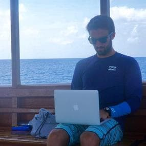

# My Portfolio - [@pj_manning](https://twitter.com/pj_manning)

## Live Site URL

[https://pjmanning.dev](https://pjmanning.dev)

## Features

-   Built with [Nuxt](https://nuxtjs.org/)
-   Clean and minimal design
-   Blog with markdown content for posts
-   Sitemap in XML

## Installation

1. Clone the repo: `git clone https://github.com/pjmanning/pjmanning-dev.git`
2. `cd pjmanning-web`
3. `yarn install`
4. `yarn dev` to start a local dev server at `http://localhost:3000`

## Notes

-   If you want to deploy your own site for free - check out [Netlify](https://netlify.com)
-   Tweet at me your creation ;) [@pj_manning](https://pj_manning.dev)

## Contact

PJ Manning - [@pj_manning](https://twitter.com/pj_manning)
